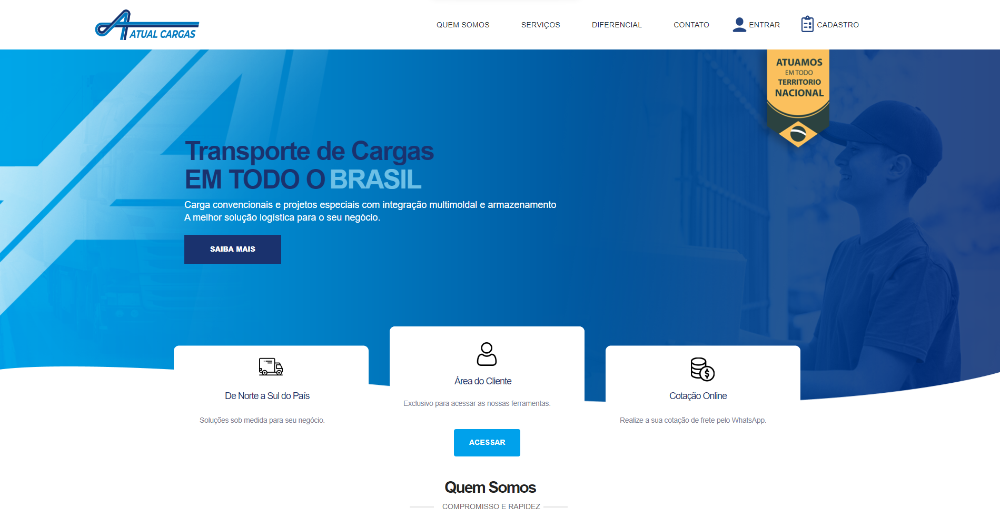

<h1 align="center">
  🚛 Atual Cargas -  Pablo Santos
</h1>

  O propósito central de um sistema de gestão de estoque é coordenar e administrar de forma eficiente os recursos  marmazenados,com o objetivo de garantir níveis apropriados de disponibilidade de produtos de maneira rápida e precisa.

## 📃 Seções
O Sistema da Atual Cargas é composto por:

  -  Seção Home: ** Nele temos uma breve apresentação;
  -  Seção Quem Somos: ** Nele temos uma breve apresentação sobre quem somos;
  -  Seção Serviços: ** Nele temos uma apresentação dos nossos tipos de serviços;
  -  Seção Diferencial: ** Nele temos uma breve apresentação do diferencial da nossa empresa;
  -  Seção Contato: ** Nele temos uma apresentação de como você pode entrar em contato conosco;
  -  Seção Login: ** Nessa seção ficara o login de usuário;
  -  Seção Cadastro: ** Aqui apresenta o registros necessários para poder fazer um cadastro;
  -  Seção Estoque: ** Apresenta os produtos de estoque cadastrados no sistema;
  -  Seção Estoque-Cadastro: ** Nele temos a parte do cadastro de produto;
  -  Seção Estoque-Editar: ** Nele temos a parte de edição de produto;
      

## 👨🏽‍💻 Tecnologias utilizadas
Para o desenvolvimento do Sistema estou utilizando as seguintes tecnologias:
  - Figma;
  - Visual Studio Code;
  - localhost;
  - HTML ;
  - Css;
  - JavaScript;
  - Php;
  - Mysql.
